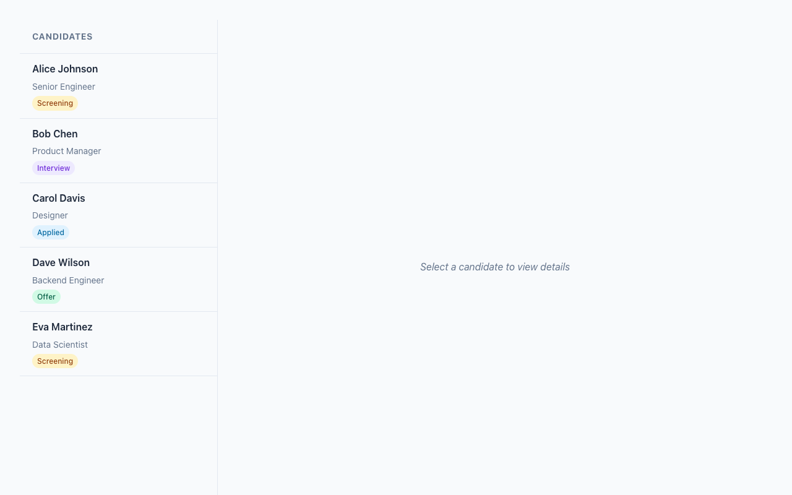
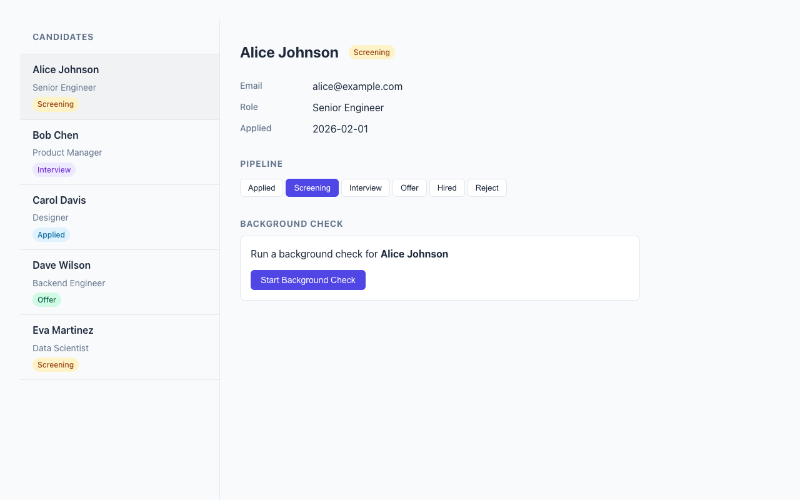
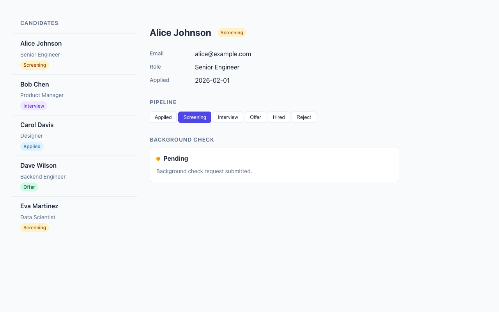
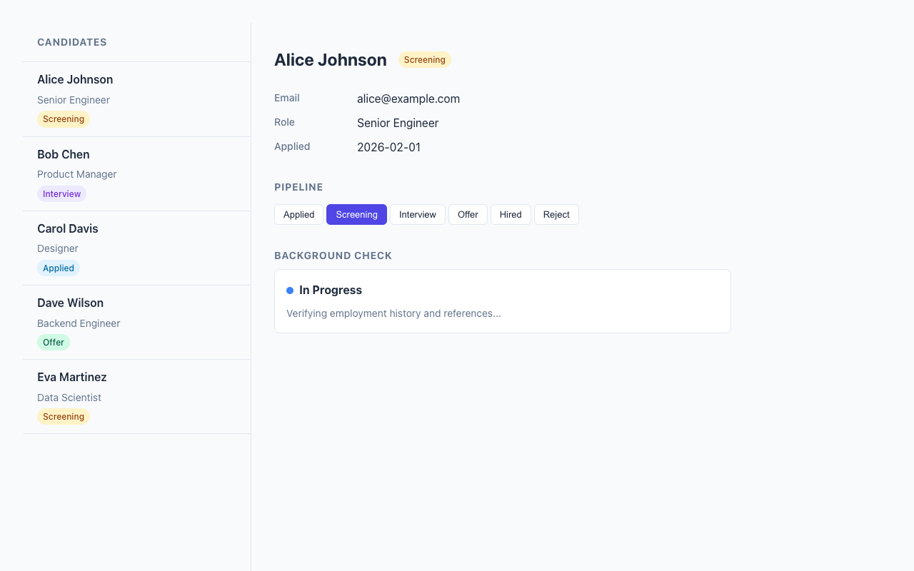
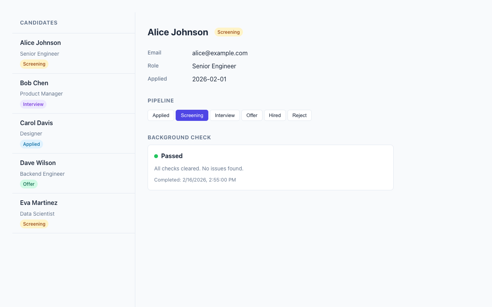
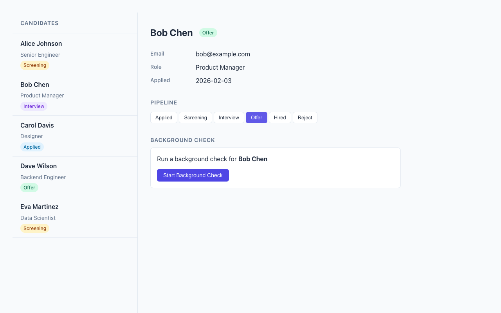

Here's a question I explored for a while: what's the right way to embed a third-party widget in a server-rendered app? Shadow DOM gives you encapsulation but fights your stylesheets. Iframes are isolation tanks - great for ads, terrible for integrated UIs. And React-style portals? Well, you need React for that.

Turns out there's a surprisingly elegant pattern hiding in plain sight: Light DOM web components. Custom element tags, server-rendered HTML inside them, global CSS applies directly. No shadow boundaries. No postMessage bridges.

I built an Applicant Tracking System example for HSX that demonstrates this pattern - a host app embedding a "third-party" background check widget. Two files, zero client-side JavaScript frameworks, and the widget is fully styled by the host's CSS. Let me walk you through it.

## The Setup: ATS with an Embedded Widget

The example is a two-column applicant tracking interface. Candidate list on the left, detail panel on the right. The detail panel includes a background check widget that simulates an external provider's component.



The whole thing is server-rendered with HSX (an SSR-only JSX renderer for HTMX). Clicking a candidate loads their detail panel via HTMX, no page reload. Here's the cool part: the background check widget lives inside a `<hsx-bgcheck>` custom element tag, rendered on the server, and the host app's CSS styles it directly through semantic class names.



## The Widget: Light DOM Custom Element

The background check widget follows HSX's `Widget<P>` protocol. To me is interesting that the most important property here is `shadow: "none"` - this means Light DOM, no encapsulation:

```tsx
export const bgcheckWidget: Widget<BgCheckProps> = {
  tag: "hsx-bgcheck",
  shadow: "none",
  styles: "",  // Empty! The host provides all styling.

  render(props) {
    const { candidateId, candidateName, status } = props;

    if (status === "none") {
      return (
        <div class="bgcheck-form">
          <p>Run a background check for <strong>{candidateName}</strong></p>
          <button
            class="bgcheck-action"
            post={`/bgcheck/${candidateId}/initiate`}
            target="closest hsx-bgcheck"
            swap="outerHTML"
          >
            Start Background Check
          </button>
        </div>
      );
    }
    // ... pending, in_progress, passed, failed states
  },
};
```

Look at what's happening with that button. The HSX attributes `post`, `target`, and `swap` compile to `hx-post`, `hx-target`, and `hx-swap` on the server. The `target="closest hsx-bgcheck"` is HTMX's CSS selector targeting - it finds the nearest `<hsx-bgcheck>` ancestor and replaces it. No JavaScript event handlers, no DOM manipulation. Just declarative HTML attributes.

The widget uses semantic class names - `.bgcheck-form`, `.bgcheck-progress`, `.bgcheck-result`, `.bgcheck-action` - that the host application can target with its own CSS. The widget brings zero styles of its own. This is the opposite of Shadow DOM philosophy, and for integrated UIs, it's exactly what you want.

## Rendering: Server-Side Custom Elements

The tricky bit is getting the custom element tag into the server-rendered HTML. HSX's renderer handles unknown tags as-is, so `<hsx-bgcheck>` just works in JSX. But you need a thin wrapper to bridge the widget protocol with the HTMX polling behavior:

```tsx
function BgCheckElement({ candidateId }: { candidateId: number }) {
  const result = getCheckResult(candidateId);
  const name = findCandidate(candidateId)?.name ?? "Unknown";

  const validationResult = bgcheckWidget.props.validate({
    candidateId, candidateName: name,
    status: result.status, ...
  });

  if (!validationResult.ok) {
    return <hsx-bgcheck><p>Error loading background check.</p></hsx-bgcheck>;
  }

  const content = bgcheckWidget.render(validationResult.value);
  const isPolling = result.status === "pending" || result.status === "in_progress";

  if (isPolling) {
    return (
      <hsx-bgcheck get={`/bgcheck/${candidateId}`} trigger="every 3s" swap="outerHTML">
        {content}
      </hsx-bgcheck>
    );
  }

  return <hsx-bgcheck>{content}</hsx-bgcheck>;
}
```

This means the `<hsx-bgcheck>` wrapper conditionally carries HTMX polling attributes. When a check is in progress, `trigger="every 3s"` tells HTMX to re-fetch the widget content from `/bgcheck/:candidateId` every three seconds and replace the entire element. When the check completes, the trigger is gone - polling stops automatically.

The server output looks like this:

```html
<hsx-bgcheck hx-get="/bgcheck/1" hx-swap="outerHTML" hx-trigger="every 3s">
  <div class="bgcheck-progress">
    <div class="bgcheck-status-row">
      <span class="bgcheck-status-dot bgcheck-status-pending"></span>
      <strong>Pending</strong>
    </div>
    <p class="bgcheck-detail">Background check request submitted.</p>
  </div>
</hsx-bgcheck>
```

Standard HTML. Custom element tag wrapping server-rendered content. HTMX attributes for interactivity. The browser doesn't need to know anything about widgets or components - it just sees HTML.

## Conditional Polling: The Self-Stopping Pattern

This is the pattern I find most satisfying in the whole example. The polling approach comes from the same idea as HSX's polling example, but applied to a widget lifecycle:



When you click "Start Background Check", the server initiates the check and returns the widget with polling attributes. Every 3 seconds, HTMX fetches fresh HTML. The server-side simulation advances the check through states: pending, in progress, passed or failed.



Once the check reaches a terminal state, the server renders the `<hsx-bgcheck>` tag without any `trigger` attribute. HTMX sees no trigger, polling stops. No cleanup code, no clearInterval, no WebSocket teardown.



```tsx
// Polling: trigger present = poll, trigger absent = stop
const trigger = done ? undefined : "every 3s";
return (
  <hsx-bgcheck get={route} trigger={trigger} swap="outerHTML">
    {content}
  </hsx-bgcheck>
);
```

This depends of a simple insight: the absence of an attribute is itself a meaningful signal. Server controls the polling lifecycle entirely through HTML attributes.

## Host-Controlled Styling

The host app provides all styling for the widget through global CSS. Since the widget renders in Light DOM, there's no shadow boundary to pierce:

```css
/* The host targets the custom element and its semantic classes */
hsx-bgcheck {
  display: block;
  border: 1px solid var(--hsx-border, #e2e8f0);
  border-radius: 0.5rem;
  padding: 1rem;
  background: white;
}

.bgcheck-status-dot {
  display: inline-block;
  width: 10px;
  height: 10px;
  border-radius: 50%;
}

.bgcheck-status-pending     { background: #f59e0b; }
.bgcheck-status-in_progress { background: #3b82f6; animation: pulse 1.5s infinite; }
.bgcheck-status-passed      { background: #22c55e; }
.bgcheck-status-failed      { background: #ef4444; }
```

The widget defines the semantic structure (class names like `.bgcheck-form`, `.bgcheck-result`). The host defines the visual presentation. This is the contract - the widget says "I have a status dot" and the host says "status dots look like this in my design system." Clean separation, no style encapsulation to fight against.

## The HTMX Interaction Model

The whole app uses five `hsxComponent` routes. Each one co-locates its path, HTTP method, handler, and render function:

```tsx
const CandidateDetail = hsxComponent("/candidates/:id", {
  methods: ["GET"],
  handler: (_req, params) => {
    const candidate = findCandidate(Number(params.id));
    if (!candidate) throw new Error("Candidate not found");
    return { candidate };
  },
  render: ({ candidate }) => (
    <div class="ats-detail-content">
      <div class="ats-detail-header">
        <h2>{candidate.name}</h2>
        <span class={`ats-status-badge ats-status-${candidate.status}`}>
          {STATUS_LABELS[candidate.status]}
        </span>
      </div>
      {/* ... fields, pipeline, background check widget */}
    </div>
  ),
});
```

Clicking a candidate in the sidebar fires a GET to `/candidates/:id`, and the response HTML swaps into the detail panel. Clicking a pipeline stage POSTs to `/candidates/:id/status` with the new status in `vals`, and the response re-renders the detail panel with updated state.



The `vals` attribute is worth calling out. HSX compiles `vals={{ status: step }}` into `hx-vals='{"status":"screening"}'` on the server. Type-safe object in JSX, JSON string in the browser. No form fields needed for simple state changes.

## Dependency Injection Without Circular Imports

One practical detail: the widget module represents an "external provider" with its own data store, but it needs to look up candidate names from the host app's data. Circular imports would be a mess. So the widget exports a `setCandidateLookup` function:

```tsx
// In bgcheck-widget.tsx (the "external provider")
let candidateLookup: (id: number) => string | undefined = () => undefined;

export function setCandidateLookup(fn: (id: number) => string | undefined): void {
  candidateLookup = fn;
}

// In server.tsx (the host app) - called at startup
setCandidateLookup((idVal) => findCandidate(idVal)?.name);
```

Simple, explicit, no magic. The widget module has a default no-op lookup, and the host wires in the real one at startup.

## Real Talk: Where This Shines and Where It Doesn't

**Where it works beautifully:** Integrated UIs where the host app controls the visual design. Admin panels, dashboards, internal tools - anywhere you want a third-party component to look like it belongs. The zero-JavaScript-framework approach means the page is fast and the HTML is inspectable.

**The tricky bit:** Style collisions. Without Shadow DOM, a global `.status` class could accidentally style widget internals. The mitigation is namespaced classes (`.bgcheck-status-dot` instead of `.status-dot`), which is exactly what BEM solved years ago. Not glamorous, but it works.

**What you give up:** Client-side encapsulation. If someone is embedding your widget on their page and you don't trust their CSS, Shadow DOM or iframes are safer. Light DOM widgets work best when there's a collaborative relationship between host and widget - which is exactly the case for most B2B integrations.

**The polling trade:** Polling every 3 seconds is not WebSocket-level real-time. For a background check that takes 8 seconds, this is perfectly fine. For a stock ticker, you'd want SSE or WebSockets. Pick the right tool.

## Running the Example

```bash
deno task example:ats
```

Open `http://localhost:8000`, click a candidate, start a background check, and watch the polling in action. Open DevTools and inspect the `<hsx-bgcheck>` element - you'll see plain HTML in Light DOM, no shadow root, styled by the page's global CSS.

The full source is two files: `bgcheck-widget.tsx` for the widget definition and `server.tsx` for the ATS host app. About 230 lines each.

---

I built this as a proof of concept for a pattern I think is underused. Shadow DOM gets all the attention, but for server-rendered apps with HTMX, Light DOM custom elements hit a sweet spot - semantic tags in the DOM, full CSS control for the host, and HTMX handles the interactivity. No build step, no client-side framework, no iframes. Just HTML doing what HTML does best.
